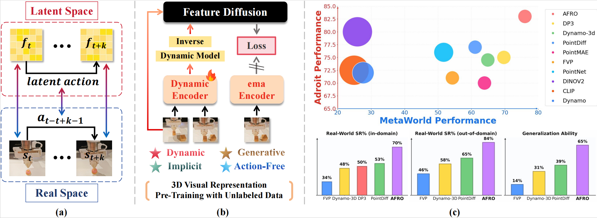

**[Project Page]** | **arXiv**(soon to come)

**[Qiwei Liang](https://kolakivy.github.io/)**, Boyang Cai, Minghao Lai, Sitong Zhuang, [Tao Lin](https://lintao.online/), Yan Qin, Yixuan Ye, Jiaming Liang, [Renjing Xu](https://openreview.net/profile?id=~Renjing_Xu1)

<p align="center">

</p>

# 💻 Installation
## Set up the environment
1. See [INSTALL.md](INSTALL.md) for installation instructions.
# 🛠️ Usage
1. **Generate demonstrations in simulation**: 
    ```shell
    bash scripts/gen_demonstration_adroit.sh hammer
    bash scripts/gen_demonstration_metaworld.sh bin-picking
    ```
    
    The first command will generate task `hammer` in Adroit, the second command line will generate task `bin-picking` in Metaworld. You can refer to DP3 to see all kinds of task supported in both Adroit and Metaworld. Tasks in dexart are also suppoted but wo don't test them in our work. **Note**: we default to collect 100 pairs of demonstration in adroit env and 25 in metaworld env, you can easily change this just in `gen_demonstration_*.sh`

2. Train AFRO: 3D self-supervised pipeline to pretrain the visual encoder
	```shell
	bash scripts/pretrain_afro.sh afro adroit_pen 0001 0 0
	```
	- arg2: config_name   (here refers to afro.yaml in config)
	- arg3: task_name
	- arg4: additional information to name the outputs directory
	- arg5: seed
	- arg6: GPU_id

3. Train state_encoder and diffusion head:
	```shell
	bash scripts/train_afro_policy.sh afro_policy adroit_pen 0001 0 0
	```
	**Note**: you should ensure that the second and third parameter inputs are the same as those pre trained in order to load correctly checkpoint.

4. (Optional)Train state_encoder and diffusion head, Meanwhile fine-tune pre-trained visual_encoder weights
	```shell
	bash scripts/train_afro_policy_ft.sh afro_policy adroit_pen 0001 0 0
	```
	This will train state_encoder and diffusion head with learing rate 1.0e-4 and fine-tune visual_encoder weights with learing rate 1.0e-5


# 🤖 Real Robot
**Hardware Setup**
1. Franka Robot
2. **L515** Realsense Camera (**Note: using the RealSense D435 camera might lead to failure of DP3 due to the very low quality of point clouds**)

**Software**
1. Ubuntu 20.04.01 (tested)
2. [Franka Interface Control](https://frankaemika.github.io/docs/index.html)
3. [Frankx](https://github.com/pantor/frankx) (High-Level Motion Library for the Franka Emika Robot)

**Data collect**
We manually collect expert demonstrations by remote operation and zip the raw data into `zarr` format aligning to simulation data. Remember to create a new yaml in `config/task`  folder under the name of your_realworld_task

**Real-world AFRO pretrain**
Different from pre-trainging in simulation，we replace pointnet encoder in simulation with pointtransformer encoder  in real-world experiment. You can pre-train with pointtransformer encoder by modifying `pointnet_type` in `afro.yaml`, then use the same command line as simulation:
```shell
	bash scripts/pretrain_afro.sh afro your_realworld_task afro_pretrain_pointtransformer 0 0
```
By the way, you ought to change the `pointnet_type` in `afro_policy.yaml` when you train the whole policy in real-world experiment

# 📝 Citation

If you find our work useful, please consider citing:

```
@article{liang2025whole,
  title={Whole-Body Coordination for Dynamic Object Grasping with Legged Manipulators},
  author={Liang, Qiwei and Cai, Boyang and He, Rongyi and Li, Hui and Teng, Tao and Duan, Haihan and Huang, Changxin and Zeng, Runhao},
  journal={arXiv preprint arXiv:2508.08328},
  year={2025}
}```
